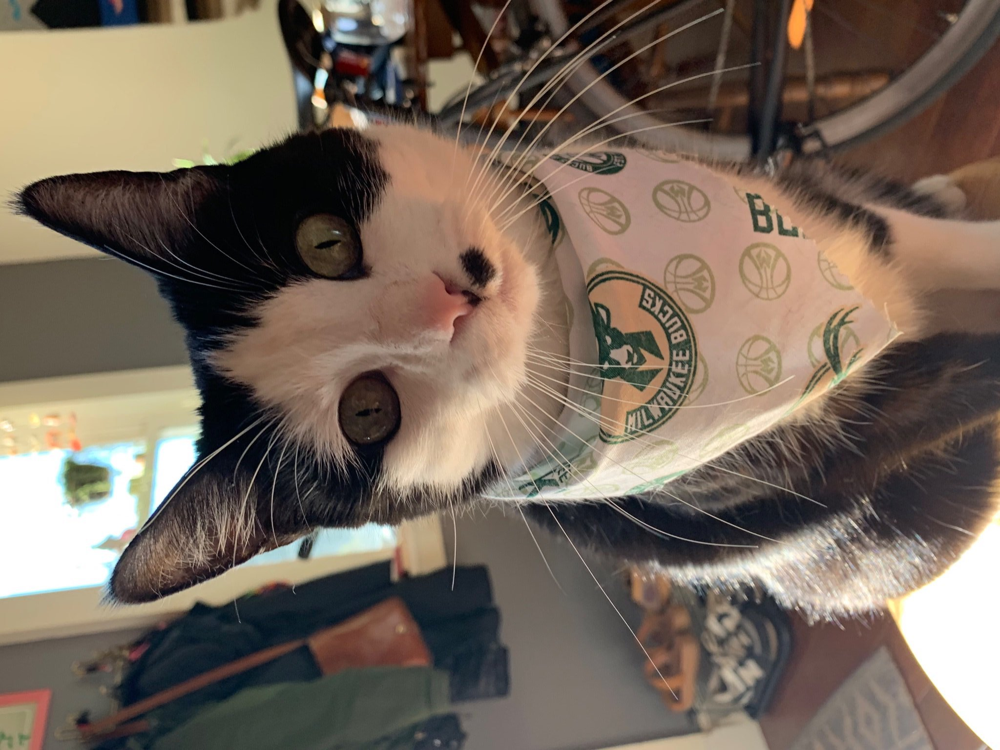

    

        

            

                
Founded in 2019, Code for Milwaukee is a group of volunteer civic hackers working together to solve local issues and help people engage with the city.

            

        

    

    

        <h2 id="project-nights">Join us at one of our upcoming project nights!</h2>
        
Our once-monthly meetups are open to anyone, and offer a chance to learn more about what we do, contribute to a current project, or just snag some free food!

    

    

      <h3>Thursday, June 20, 2019 @ 6:00 pm</h3>
      
3202 N Maryland Ave
       
      <a target="_blank" href="https://www.meetup.com/Code-for-Milwaukee/events/261869359/" class="usa-button">RSVP on Meetup »</a>
      

      
<strong><a href="https://www.meetup.com/Code-for-Milwaukee/events/" target="_blank">See all upcoming events »</a></strong>

    

    

      
    

  

    

         
        <h2 id="projects">Projects</h2>
        
The list of projects we’re working on is always changing! Here are a few of our past and current projects:

         
    

    
    
    

  

  

    

      <h2 id="about">About</h2>
      

        
Code for Milwaukee is a <a href="http://brigade.codeforamerica.org/">Code for America Brigade</a> located here in Milwaukee, WI. Founded in 2019, we are a group of volunteer civic hackers working together to solve local issues and help people engage with the city. We host monthly hacknights and other events to gather, discuss, and get stuff done.

        
We're looking to bring people with all different skill sets together to maximize our potential. Civic hackers aren't just developers — they're journalists, lawyers, designers, and interested citizens in general. The more community participation, the better.

        
To contact us, please email <a href="mailto:team@codeformilwaukee.org">team@codeformilwaukee.org</a>.

         
         
         
      

      

        

      

    

  

    

        <!--  
        <button> Submit a Proposal </button> -->
    

