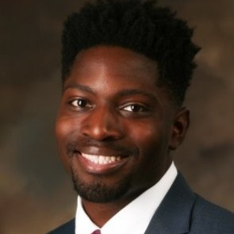
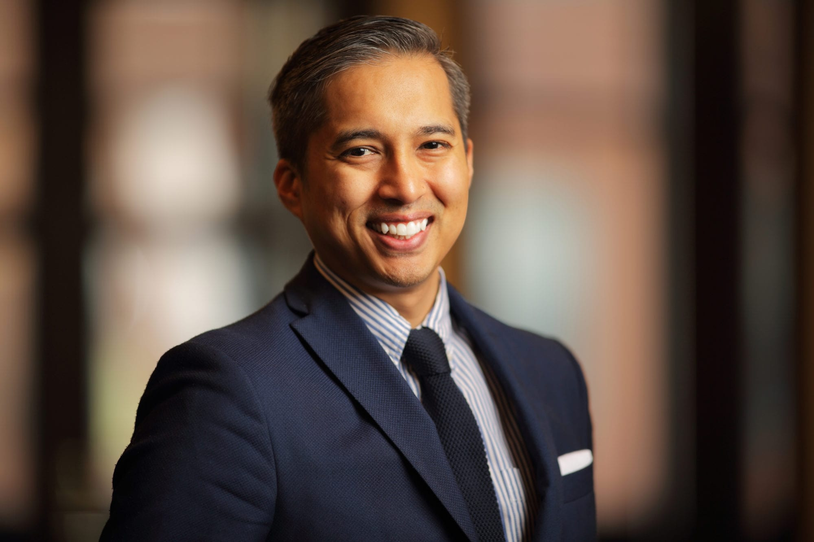
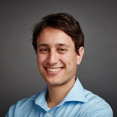

#### [Brian Barkley](https://www.linkedin.com/in/barkleybg/)

    

#### [Erin Magennis](https://www.linkedin.com/in/erinmagennis)

    

#### [Julius Lewis](https://www.linkedin.com/in/jlewis3313/)

    

#### [Romke De Haan](https://www.linkedin.com/in/romkedehaan/)

    

#### [Andrew Yaspan](https://www.linkedin.com/in/andrew-yaspan/)

    

## Former Core Team Members

#### [Mitchell Henke](https://www.linkedin.com/in/mitchellhenke/)

    

#### [Anthony Jesmok](https://www.linkedin.com/in/jesmok/)

    

<!-- ### Communications Lead
#### [Brian Barkley](https://www.linkedin.com/in/barkleybg/)

    

### Community Organizer
#### [Erin Magennis](https://www.linkedin.com/in/erinmagennis)

    

### (Software) Development Lead
#### [Mitchell Henke](https://www.linkedin.com/in/mitchellhenke/)

    

  

    

      <h3>Communications Lead</h3>
      <h3><a href="https://www.linkedin.com/in/barkleybg/">Brian Barkley</a></h3>
    

    

       

          
      

    

    

      <h3>Community Organizer</h3>
      <h3><a href="https://www.linkedin.com/in/erinmagennis/">Erin Magennis</a></h3>
    

    

      

        
      

    

  

  

    

      <h3>Development Lead</h3>
      <h3><a href="https://www.linkedin.com/in/mitchellhenke/">Mitchell Henke</a></h3>
    

    

       

        
      

    

    

      <h3>Hack Night Lead</h3>
      <h3><a href="https://www.linkedin.com/in/jesmok/">Anthony Jesmok</a></h3>
    

    

       

        
      

    

  

  

    

      <h3>Storyteller</h3>
      <h3><a href="https://www.linkedin.com/in/romkedehaan/">Romke De Haan</a></h3>
    

    

       

        
      

    

    

      <h3>Captain</h3>
      <h3><a href="https://www.linkedin.com/in/andrew-yaspan/">Andrew Yaspan</a></h3>
    

    

       

        
      

    

  

  

    

      <h3>About CfM:</h3>
      <h4>Who We are</h4>
      
Code for Milwaukee is a Code for America Brigade located here in Milwaukee, WI. We are software developers, community organizers, government employees, local businesspeople, artists and storytellers, and civic geeks of all kinds and colors. We are a non-partisan non-profit organization, and our network is open to any person who wants to help make Milwaukee a safer, healthier, and more fun city to live in.

### Captain
#### [Andrew Yaspan](https://www.linkedin.com/in/andrew-yaspan/) -->

      

        <a target="_blank" href="https://forms.gle/SpCTwWxsDdmsB6kj6" class="usa-button">Join the Mission!</a>
      

    

  

<!-- ## Open Positions

### Treasurer

#### Opportunity: 

Code for Milwaukee (CfM) is looking for a Treasurer to help guide the financial side of our non-profit efforts. This is an unpaid, volunteer position. The Treasurer is a member of the CfM Core Team, and will report primarily to Brigade Captain Andrew Yaspan. To apply please fill out [this brief form](https://docs.google.com/forms/d/e/1FAIpQLSdFK33qZQOhhGHSHFsMyidTgPU_kIOt6TBD7xirXUI_OaQXvw/viewform). Application is due by Sunday, November 10th at 11:59pm. 

#### Roles and responsibilities:

At current, roles and responsibilities include:

- Managing receipts, budget, and bank account, and disbursing funds. 
- Helping to arrange food at CfM’s major events (like our monthly Hack Nights)
- Securing sponsorship or grants: 
    - For CfM’s major events
    - For project infrastructure (paying for web hosting or services like AWS) 
- Planning for future financial needs (larger events, growth objectives, etc)
- Collaborating with other CfM Core Team members
- Innovating on the above items to make planning and funding as streamlined as possible
- Assisting in upgrading our financial infrastructure 
     - CfM is exploring options to become a 501(c)3 or other protected non-profit status. Applicants for the Treasurer position should also be prepared to help CfM to apply for protected status and to operate under this status.
- Attending our major events (e.g., monthly Hack Nights) whenever possible

#### Estimated hours: 
Often 5-15 hours in a typical month (but can be as low as 1 hour if you help us to get our finances in order)

#### Desired competencies:

- Balancing a budget
- Fundraising 
- Good electronic communication 
- Nice human 
- **Coding and Programming skills are** *NOT* **required for this position.** 

#### Benefits:
Through this role, you will have a direct impact on improving the lives of people in Milwaukee and help ensure that Code for Milwaukee’s initiatives can be sustainable to have a lasting impact. This position can additionally serve as a stepping stone to further connections within technology, politics, and the non-profit sector at large.  -->

